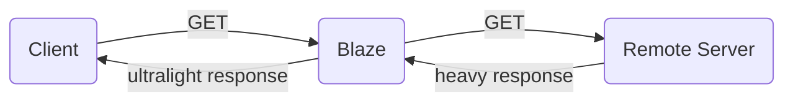
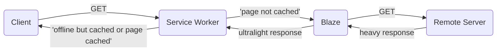
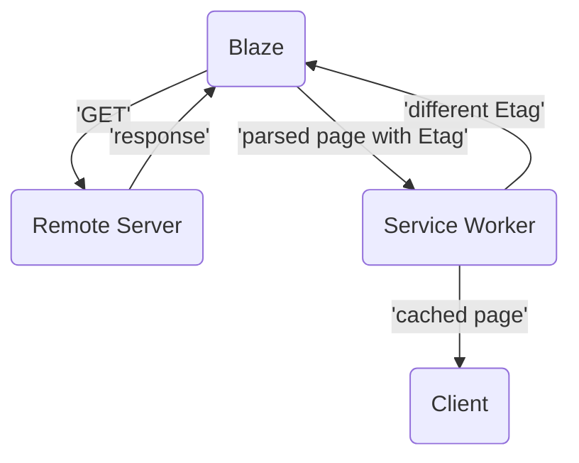

<h1 style="text-align: center">BLA⚡️E</h1>

Blaze is an ultrafast search engine designed to minimize data transfer between clients and servers, enabling users to browse the web in a minimalist manner.
 
 
The main goal and purpose of Blaze is to allow users to search for information in all connectivity conditions, including poor, slow, or unstable connections. It also works offline, providing access to previously visited pages.

## 💪 Features

- **Surf the web in all conditions**: Blaze allows users to navigate the web even in poor connectivity conditions, such as unstable or slow connections.
- **Minimalist Search**: Blaze aims to reduce data transferred between clients and servers, providing a minimalist search experience.
- **Lightweight Page Rendering**: When a search result is clicked, Blaze generates a lightweight version of the web page using the Readability library, ensuring quick loading even under challenging connection conditions.
- **Cache-based and Offline Mode**: Every page visited through Blaze is saved in the service worker cache, making it accessible offline. Additionally, the service worker provides fast access to already visited pages even when online.

## 🔧 How It Works

The idea behind Blaze is straightforward:

Blaze acts as a middleware between the client and the servers where the requested pages are located.

Let's explore the behavior in case of no connection at all:

As shown in the diagram, the service worker plays a central role in Blaze. The service worker's cache enables offline access to previously visited pages.

However, what happens if the client is online and requests a cached page that has been updated? In this case, the service worker first checks if the requested page is the same (in terms of HTML) as the cached page.

To achieve this, Blaze sets an HTTP header called 'X-Blaze-Etag' when parsing the page. This header is used to compare the cached page's header with the requested page's header. If they differ, the page is requested again and saved in the cache:

## 👌 Implications and Benefits

Blaze addresses the issue of slow internet connections and enables seamless browsing even in challenging conditions. By minimizing data transfer, Blaze offers several benefits:

1. **Faster Browsing**: With Blaze, users can search for information and load pages extremely quickly, even with poor internet connections.
2. **Reduced Bandwidth Consumption**: Blaze significantly reduces the amount of data transferred between clients and servers, resulting in lower bandwidth consumption.
3. **Battery and Processor Efficiency**: Browsing lightweight and minimalist web pages puts less stress on the device's battery and processor, leading to improved efficiency.
4. **Ad-Free Experience**: Blaze pages are mostly free from ads, enhancing the browsing experience and reducing distractions.
5. \*\*Environmental

Impact**: Blaze's minimal data transfer approach contributes to environmental sustainability by reducing battery drain, decreasing the need for frequent charging, and potentially lowering CO2 emissions. 6. **Emergency Search Engine\*\*: Blaze can be considered an "Emergency search engine." It provides access to critical information even in situations with poor connectivity.

## 🧑‍💻 Getting Started

To run your own instance of Blaze or contribute to the project, follow these steps:

1. Clone the repository: `git clone https://github.com/daaanny90/blaze-this-page.git`
2. Install the dependencies: `npm install`
3. Set up environment variables:
   - Create a `.env` file in the root directory.
   - Add your Brave Search key as `CYCLIC_BRAVE_KEY` in the `.env` file.
4. Start the server: `npm start`
5. Access Blaze in your browser at `http://localhost:8888`

Please note that you need to obtain a Brave Search key to use Blaze effectively. Visit the [Brave Search website](https://search.brave.com) for more information.

## ✌️Contributing

Contributions to Blaze are welcome! Feel free to open issues or submit pull requests on the GitHub repository. Please follow the existing code style and provide clear descriptions of your changes.

## License

This project is licensed under the [MIT License](LICENSE).
